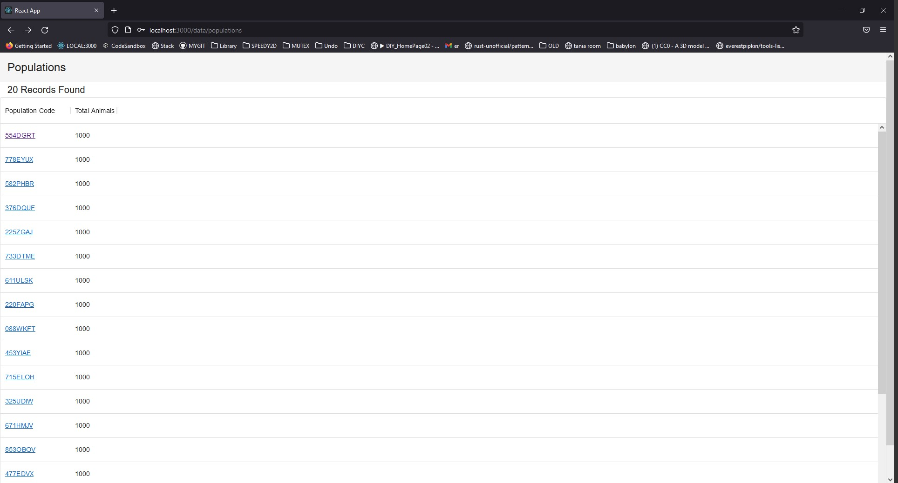
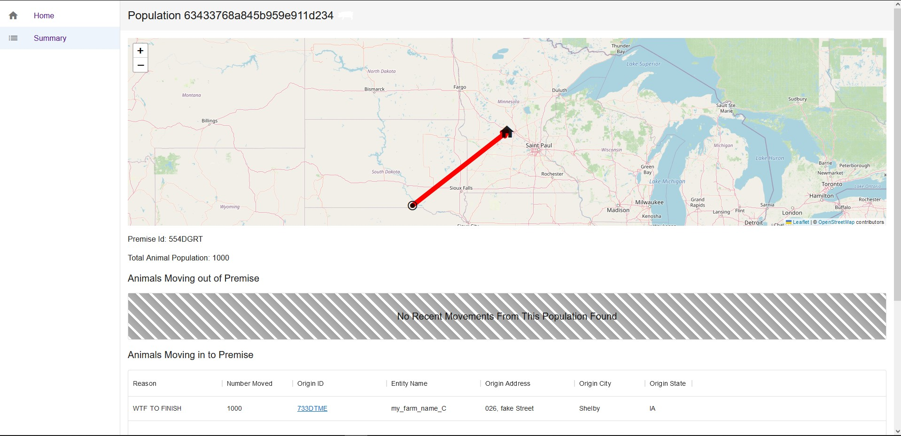
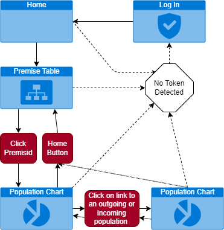

# Programming challenge

## Background

In food animal systems, animals move to different farms as they age. Each farm
has a unique ID and must keep a record of the movement of animals from one farm
to another. Here, we present some fictitious records of movements among pig
farms.

_Description of the data folder_

- _movements_: all records of animal movements

  - new_originpremid - column with the ID of the origin farm
  - new_destinationpremid - column with the ID of the destination farm
  - new_numitemsmovedcolumn - column with the number of moved animals

- _population_: complete list of the farms
  - premiseid - column with the ID of the farms
  - total_animal - column with the current number of animals for the farm

## Challenge

The challenge is to create a system to visualize the movement records. This
system have to follow the requirements bellow:

- The REST API has to written in Java, Python or Typescript. It can use any
  framework/library that you desire;
- The Web Client have to written in Typecript, and you can use any _SPA
  framework/library_ that you desire, ex Angular, React, etc...;
- Your submitted project should include instructions on how to run it;

The submitted project will be evaluated considering your experience. For example, a
person with a background in backend development will be evaluated with higher
expectations of the API and database code. A UI person will be evaluated with
higher expectations on the design of the UI.

Bonus points will be awarded for creativity and implementing things outside the
requirements, such as:

- having an authentication in the system
- Using docker
- Having a script to run all components
- Importing the supplied data into a well normalized schema

### Results

---

> The challenge is to create a system to visualize the movement records.

✔️ The population record are visualized as sortable table data. Individuals movements to/from a population are shown via a map in the populations dashbord. Arrows indicate the direction of the movement.

---

> The REST API has to written in Java, Python or Typescript. It can use any
> framework/library that you desire;

✔️ The backend is written in Typescript using Express. The express server handles operations to a MongoDB database, and manages authentication.
See the following diagram of the client side.

---

> The Web Client have to written in Typecript, and you can use any _SPA
> framework/library_ that you desire, ex Angular, React, etc...;

✔️ React was chosen for the framework.

Client side graph:

---

> Your submitted project should include instructions on how to run it;

## ✔️Installation Instructions

1. Download this repository with git clone
2. Make sure you have yarn installed globally
3. Make sure you're using the latest version of yarn `yarn set version berry`
4. Cd your terminal shell into the directory
5. Run `yarn install`
6. Run `yarn start` to start both server and client. The server will start on port 1337 and the client on 3000, make sure you do not have any other processes running on these ports
7. Login with username and password "admin"

---

## Tasks

| Status | Description                            | Notes                                                                                                        |
| ------ | -------------------------------------- | ------------------------------------------------------------------------------------------------------------ |
| ✔️     | Having a script to run all components  | With the mono repo design, we can run both the server, client, and shared type definitions with `yarn start` |
| ✔️     | having an authentication in the system | Authentication is implemented by our server, which sends a JWT to the client                                 |
